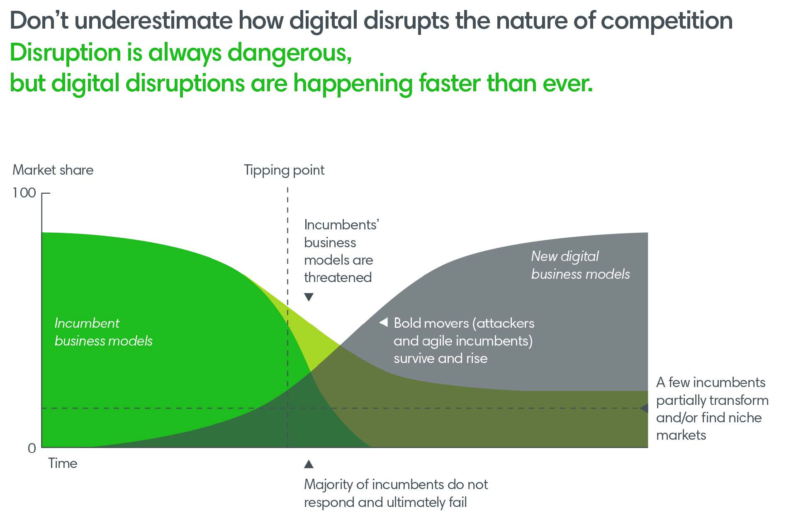
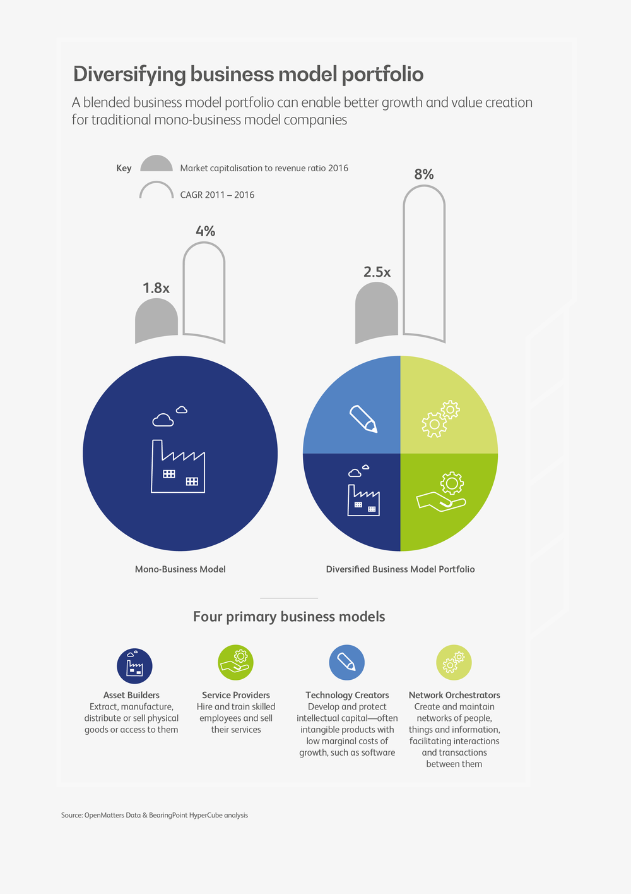
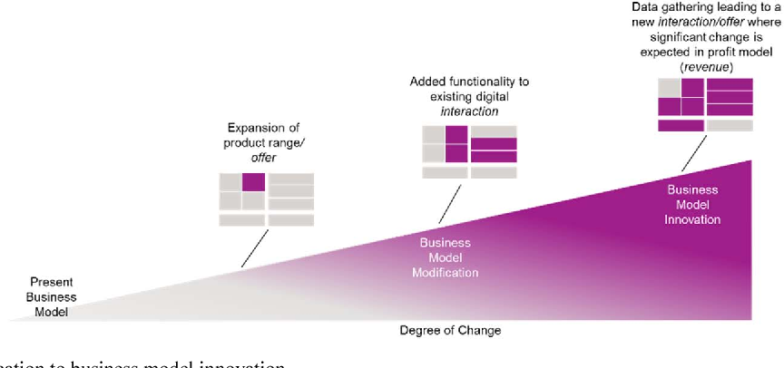
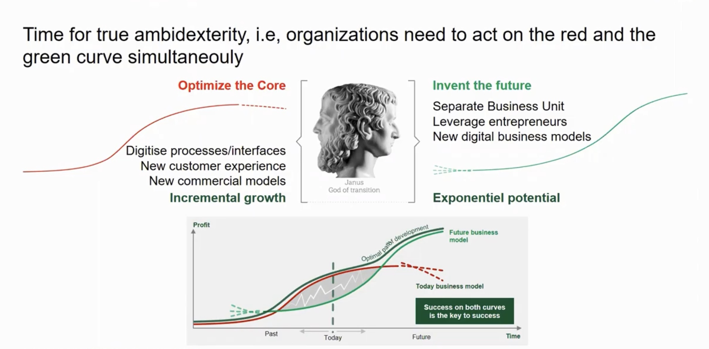

# Lesson #2

## Objectives

By the end of this lesson, you'll be able to describe how disruption facing companies today amplifies the need for DevOps.

## What are business up against?

Since the year of 2000, 52% of the [Fortune 500](https://en.wikipedia.org/wiki/Fortune_500) companies are gone. What are they up against? In a word, _disruption_.

To get disrupted isn't a matter of if you will, is a matter of when you will.

Established institutions like banks might think, “Who is going to disrupt me?”. You can talk to banks about the need to deploy fast and use continuous delivery, but they are not always responsive. Then the bank down the street comes out with an app that can take a picture of a check and deposit it. Meanwhile, if it takes your bank six months to get your app updated to take a picture of a check and deposit it, your bank is going to lose a lot of customers in those six months. See?

For better understanding here is a chart from [McKinsey & Company](https://www.mckinsey.com/) on how digital disruption is outpacing established businesses.

And here is an extra, an article from the [Harvard Business Review](https://www.linkedin.com/company/harvard-business-review/) dissecting the meaning of [disruptive innovation](./assets/html/HBR/).

You may hear from customers being disrupted things like - “Oh, the technology disrupted me. I have been disrupted by technology.” - But if you think about it the technology that was available to the disruptors is the same technology that is available to the incumbents because most of it is open source. The disruptors just had a different business model.

Following an excerpt about how some companies dealt with disruption. The example lots of people like to give is [Uber](https://www.uber.com/), Uber is the big disrupter.

So, let's think about what was the amazing technology that allowed Uber to disrupt the taxi industry? Well, they had GPS, but GPS has been around for a while. We’ve had [Garmins](https://www.garmin.com/) and [TomToms](https://www.tomtom.com/) on our dashboards for years, so that's nothing new, that is fairly old technology. Then there are electronic payments. Electronic payments are older than GPS—they have been around for decades. Then there is "a smartphone in every pocket" which is pretty commonplace as well, but Uber put the three of those things together with a new business model.

Instead of waiting for a taxi to drive by or hailing a cab, or making a phone call to a dispatcher what if... - "Allow people to summon a driver from their smartphone? Let the driver know where they are, and then the nearest driver comes and gets them, and they can track where they are when they will be picked up.".

Uber had a different business model and people loved it. It wasn't so much the technology, it was the new business model that allowed them to disrupt. In fact, New York State, the taxi industry is lobbying Albany, the state capitol, for legislation to limit Uber.

The taxi industry does not need government legislation, they need to hire some programmers and get an app! The genie is out of the bottle.

This is the way people want to do ride-sharing. You either adapt or you go extinct! Disruption is everywhere in every industry. When was the last time you used a travel agent? You do that on the web now. What about those little point-and-shoot cameras? That was a major industry, and everyone was buying them. Now, not so much... because everyone has a pretty good camera in their pocket on their smartphone. People used to ask - “What's the best camera to use for candid shots?" - just to get the response - “The camera that you have with you, the one in your pocket.”
That’s the best camera to use. So, people don't generally need to have these point-and-shoot cameras anymore. They got disrupted by the smartphone.

Think about Blockbuster Video. Back in the 80s, we would rent videotapes, VCRs were a big thing, we would physically go to the Blockbuster store.
If we brought the tape back late, they would penalize us. It was like checking in a library book late. We accepted it! Then Netflix came around and Netflix realized that DVDs had just come out and that DVDs were a lot smaller than these big bulky tapes. They could mail them out so the first business model for Netflix was that they would mail you a DVD and then you would have a list of DVDs that you wanted. You did not get the next DVD until you mailed the one you had back. If you kept it for six months, that didn’t change, they did not give you a late fee. They did not care if you kept it for six months, you just didn't get another one for six months, you had to send one back before you could get another one.

Then after a while, Netflix realized they did not need the DVDs. Everyone has broadband internet to their homes. So, Netflix began streaming the movies into the customers' homes. The problem for Blockbuster was that they thought they were in the video rental business. But Netflix understood they were in the entertainment business. They were in a totally different business, they were entertaining people now, and now they have their own shows on Netflix, produced shows by Netflix, and Blockbuster went out of business.

If you look at Garmin, they did not do so badly. Garmin was able to pivot. When everybody had a GPS on their phone, they didn't need a Garmin on their dashboard anymore. But Garmin understood that they were not in the mapping business. They realized they were in the tracking business. They started making little wrist trackers. Garmin made these trackers you use to exercise and stuff. They pivoted and they are still around.

Some businesses survive and some businesses do not, but the message here is that technology is the enabler of innovation. It is not the driver of innovation. You must have a great business model idea and a great model and then leverage that technology.

Technology alone is not going to drive innovation, it just enables it. So keep that from our lesson:

- Technology is the enabler of innovation.
- The importance of having an innovative business model.

Below there are a few diagrams to inspire you on how your daily business model could be remodeled and adapted to new technology.

Sorry for not crediting the authors, but with a simple image search you can trace their origin.
